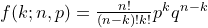
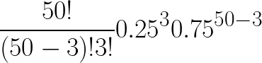

The goal of this exercise is to learn some best practices for writing Python
code.

# Contents

-   [Getting set up](#getting-set-up)
-   [Learning objective](#learning-objective)
-   [The goal](#the-goal)
-   [The script](#the-script)
-   [Best practice 1: Put code into functions](#best-practice-1-put-code-into-functions)
-   [Best practice 2: Write modules not scripts](#best-practice-2-write-modules-not-scripts)
-   [Best practice 3: Use docstrings to document your code](#best-practice-3-use-docstrings-to-document-your-code)
-   [Best practice 4: Add tests to your docstrings](#best-practice-4-add-tests-to-your-docstrings)
-   [Acknowledgments](#acknowledgments)
-   [License](#license)


# Getting set up

At this point, you should have
(1) an account on [Github](https://github.com/) and
(2) been introduced to the very basics of [Git](https://git-scm.com/).

1.  Login to your [Github](https://github.com/) account.

1.  Fork [this repository](https://github.com/joaks1/python-script-best-practice), by
    clicking the 'Fork' button on the upper right of the page.

    After a few seconds, you should be looking at *your* 
    copy of the repo in your own Github account.

1.  Click the 'Clone or download' button, and copy the URL of the repo via the
    'copy to clipboard' button.

1.  In your terminal, navigate to where you want to keep this repo (you can
    always move it later, so just your home directory is fine). Then type:

        $ git clone the-url-you-just-copied

    and hit enter to clone the repository. Make sure you are cloning **your**
    fork of this repo.

1.  Next, `cd` into the directory:

        $ cd the-name-of-directory-you-just-cloned

1.  At this point, you should be in your own local copy of the repository.

1.  As you work on the exercise below, be sure to frequently `add` and `commit`
    your work and `push` changes to the *remote* copy of the repo hosted on
    GitHub. Don't enter these commands now; this is just to jog your memory:

        $ # Do some work
        $ git add file-you-worked-on.py
        $ git commit
        $ git push origin master

# Learning objective 

Learn to implement recursion to a set of collected data organized using object-oriented programming techniques.

# The goal

You will be identifying the frequency of a disease allele within a sampleset and determine the probability of your findings given the frequency of this allele within the population. 

# Overview

## Recursion

A recursive function calls itself one or more times until a specified condition is met, at which time the reset of each repitition is processed from the most recent call to the original.

Recursive processes are useful when the space to be examined is complex (e.g. tree traversal). While we aren't going to address these scenarios in this class, we will introduce the process of recursion using a simple example: the factorial.

In introductory math classes you learn that factorials are the product of all positive numbers from 1 to a given number n (represented as n!). This mathematical process can be coded iteravely as follows:

```
def get_factorial_iter(n):
    result = 0
    j = 0
    for i in range(1,n+1):
       result *= i 
    return result
```

However, you can also code this process recursively as follows:

```
def get_factorial_recur(n):
    if n == 1:
        return 1
    else:
        return n * get_factorial_recur(n-1)
```

## Bernoulli Trial

A Bernoulli trial is a random experiment with two possible outcomes. Using a binomial distribution, the probability of an outcome can be calculated using the following formula:




Where k = the number of occurences of a trait, n = the sample size, and p = the frequency of a trait in a population.

For example, if the frequency of a trait in a population is 0.25 and you collect 50 individuals from the population, here is how you would calculate the probability that 3 of the 50 individuals have that trait:



# The project

The trait "blue" has a frequency of 0.3 within the population. This trait is encoded by the "Aubie" gene when the fourth amino acid is a Serine (Ser; S). The other trait, "orange", occurs when the fourth amino acid is an Argenine (Arg;R). Within this repository, there is a fasta file titled ```Aubie.fasta```. You are to do the following:

1. Create a class with attributes for each individual's (A) sampleID, (B) date of sequencing, (C) locality where sample is from, (D) phenotype ("orange" or "blue"), and (E) nucleotide sequence.
1. Calculate the total number of individuals in your sample set (your 
1. Calculate the frequency of the "orange" trait within your sample set
1. Provide a list of all individuals with the "orange" trait 
1. Calculate the probability of finding 
